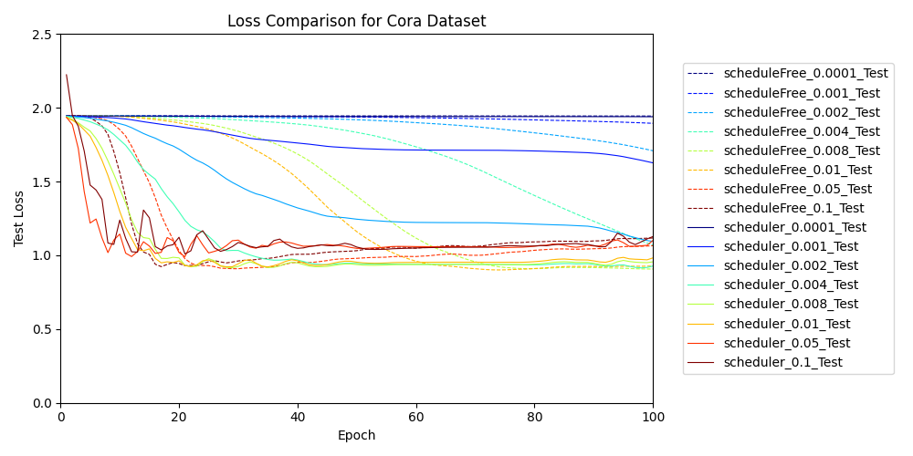
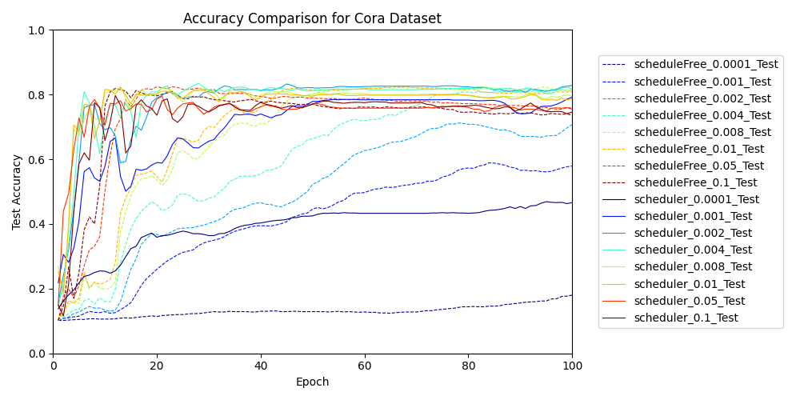

# schedule-free-experiment
Experiments on the convergence speed when applying [RAdamScheduleFree](https://github.com/facebookresearch/schedule_free/tree/main).

# setup
Install [Rye](https://rye-up.com/) and run the following command.

```bash
rye sync
```
# GNNs
Details are explained on [Zenn](https://zenn.dev/zenkigen_tech/articles/8356bed81aec91).


## run
```bash
# For Rye users:
# run the experiment
# NOTE: The `data` directory will be created, and the data will be downloaded there during the first run.
rye run python src/schedule_free_experiment/gnn/scheduler.py
rye run python src/schedule_free_experiment/gnn/schedule_free.py
# visualize the results
rye run python src/schedule_free_experiment/gnn/draw_loss.py
```

### Reults
The loss during training and the resulting figures are saved in `gnn_loss_history`.

<div align="center">
  <br>
  
  

</div>